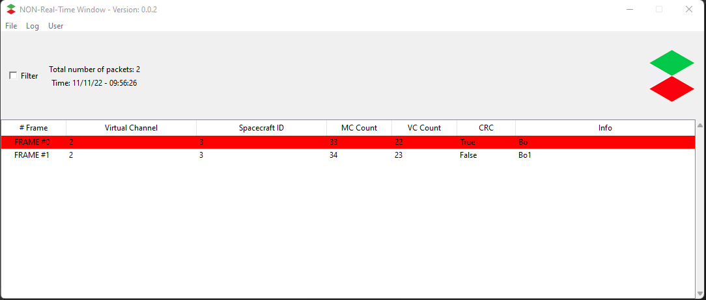
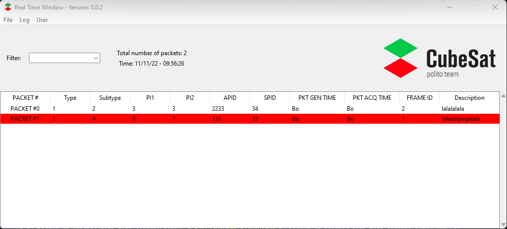

# Telemetry Extractor for C3 Project
Collaboration Project for CubeSat Team during A.A 2019/2020

## Example images

CCSDS Frame Packet manager:



CCSDS Source Packet Packet manager:




## Run

Tested on Python 3.10

Run with:
```
/path/to/python.exe main.py
```

You can add your user with password in `Users/users.data`

## Dependencies

 - Numpy
 - Matplotlib
 - tkinter
 - tkcalendar